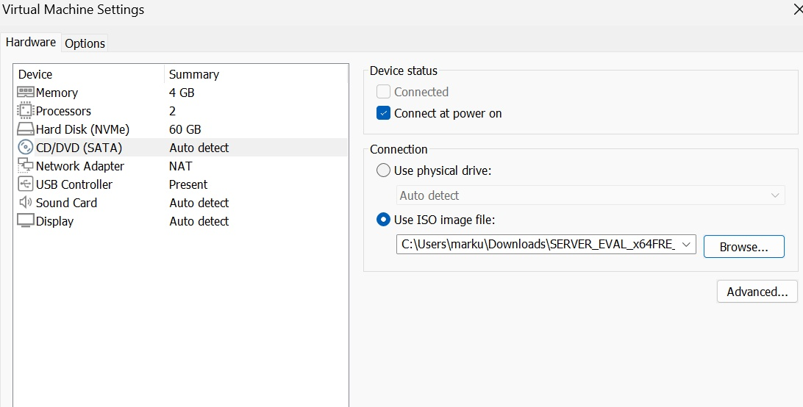
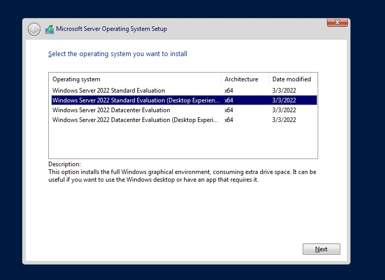
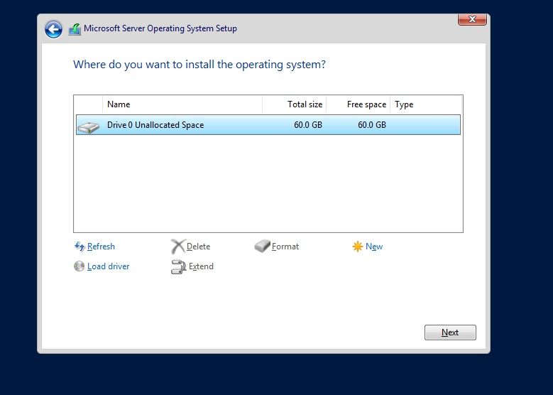
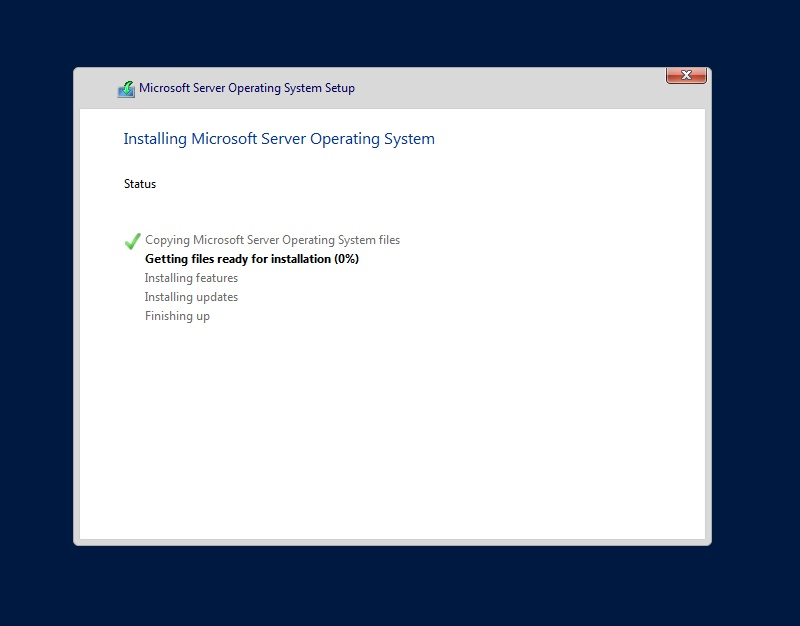
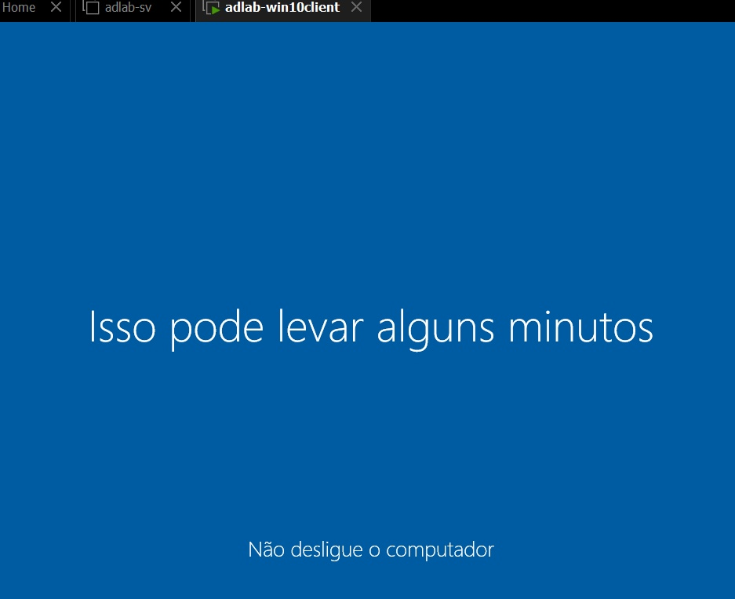
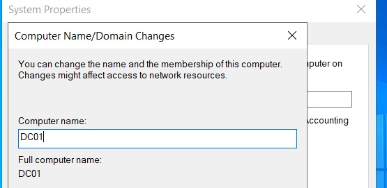
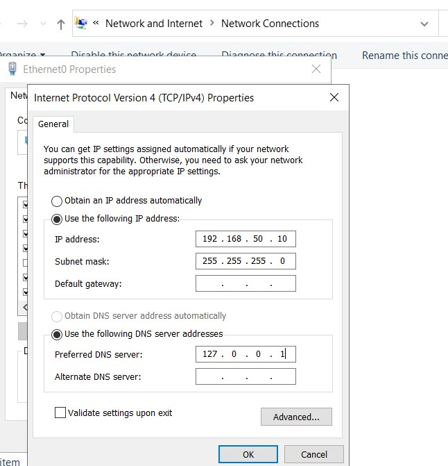
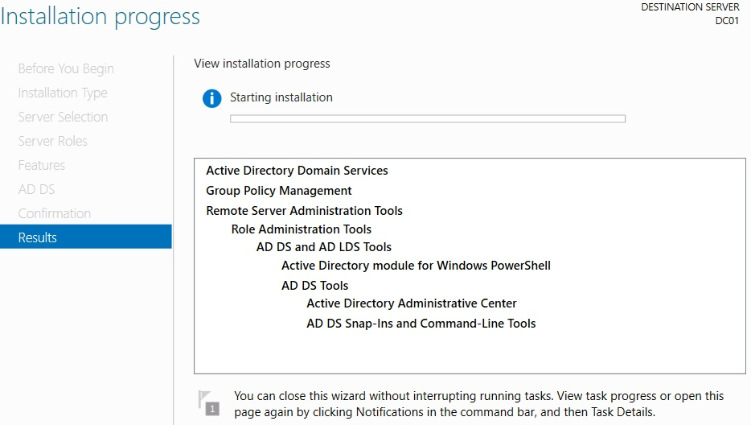
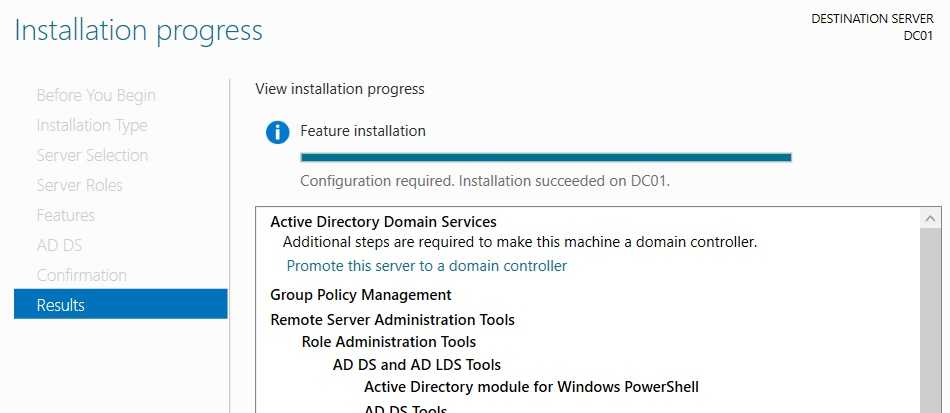
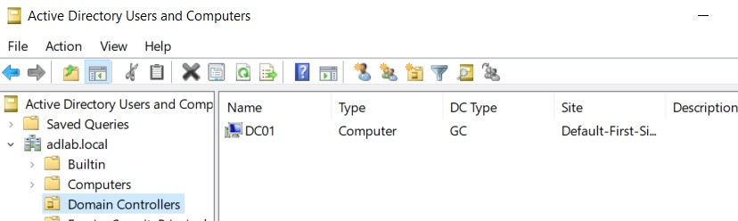

# 📄 1. Instalação do Servidor e Promoção a Controlador de Domínio

[⬅️ Voltar para o Sumário Principal (README)](../README.md)

---

## 📝 Descrição da Etapa

Este documento detalha o passo a passo para a preparação do ambiente virtual, a instalação do sistema operacional Windows Server 2022 e sua subsequente configuração e promoção a Controlador de Domínio (DC) da nova floresta `adlab.local`.

---

## 📋 Índice

- [1.1. Criação da Máquina Virtual (DC01)](#11-criação-da-máquina-virtual-dc01)
- [1.2. Instalação do Windows Server 2022](#12-instalação-do-windows-server-2022)
- [1.3. Configurações Iniciais Pós-Instalação](#13-configurações-iniciais-pós-instalação)
- [1.4. Instalação da Role de Active Directory (AD DS)](#14-instalação-da-role-de-active-directory-ad-ds)
- [1.5. Promoção a Controlador de Domínio](#15-promoção-a-controlador-de-domínio)
- [1.6. Verificação Pós-Promoção](#16-verificação-pós-promoção)

---

### **1.1. Criação da Máquina Virtual (DC01)**

A primeira etapa consistiu em criar a máquina virtual no VMWare Workstation com os recursos necessários para atuar como um servidor de domínio.

**Configurações da VM:**
- **Nome:** DC01
- **Sistema Operacional:** Microsoft Windows Server 2022 Standard
- **Memória RAM:** 4 GB
- **Processadores:** 2 vCPUs
- **Disco Rígido:** 60 GB
- **Adaptador de Rede:** Rede Interna

---

### **1.2. Instalação do Windows Server 2022**

O processo de instalação do sistema operacional foi realizado seguindo o assistente padrão da Microsoft.

A versão escolhida foi a **Windows Server 2022 Standard (Experiência Desktop)** para ter acesso à interface gráfica de gerenciamento.

---

### **1.3. Configurações Iniciais Pós-Instalação**

Antes de instalar os serviços de diretório, realizei duas configurações essenciais no servidor recém-instalado:

**1. Renomear o Computador:** O nome do servidor foi alterado de um valor aleatório para `DC01`, um nome mais descritivo para sua função.

**2. Definir um Endereço IP Fixo:** Um IP estático é mandatório para um Controlador de Domínio e servidor DNS. As seguintes configurações foram aplicadas:
- **Endereço IP:** `192.168.50.10`
- **Máscara de Sub-rede:** `255.255.255.0`
- **Gateway Padrão:** não configurado / ambiente isolado de laboratório
- **DNS Preferencial:** `127.0.0.1` 

---

### **1.4. Instalação da Role de Active Directory (AD DS)**

Através do **Server Manager**, a função de "Active Directory Domain Services" foi adicionada ao servidor.

---

### **1.5. Promoção a Controlador de Domínio**

Após a instalação da role, um aviso no Server Manager permite iniciar o assistente de promoção.

**Configurações da Promoção:**
- **Operação:** Adicionar uma nova floresta.
- **Nome do domínio raiz:** `adlab.local`
- **Nível funcional:** Windows Server 2016

---

### **1.6. Verificação Pós-Promoção**

Após a reinicialização automática do servidor, verifiquei se os serviços do Active Directory estavam funcionando corretamente.

- O **Server Manager** agora exibe as roles de **AD DS** e **DNS** ativas.
- As ferramentas de gerenciamento do AD (como "Active Directory Users and Computers") estão disponíveis no menu Iniciar.

---

**Esta etapa foi concluída com sucesso. O servidor `DC01` está agora operando como o Controlador de Domínio principal da rede `adlab.local`.**

[➡️ Próximo Passo: 2. Gerenciamento de Usuários e Grupos](02-Gerenciamento-de-Usuarios.md)