# 📄 2. Gerenciamento de Usuários e Grupos

[⬅️ Etapa Anterior: 1. Instalação e Promoção](01-Instalacao-e-Promocao.md) | [⬆️ Voltar para o Sumário Principal (README)](../README.md)

---

## 📝 Descrição da Etapa

Este documento detalha o processo de criação da estrutura organizacional (OUs), dos grupos de segurança e dos usuários de teste dentro do Active Directory. O objetivo é simular a organização de uma empresa e preparar o ambiente para a futura aplicação de permissões e políticas de grupo.

---

## 📋 Índice

- [2.1. Criação da Estrutura de Unidades Organizacionais (OUs)](#21-criação-da-estrutura-de-unidades-organizacionais-ous)
- [2.2. Criação dos Grupos de Segurança](#22-criação-dos-grupos-de-segurança)
- [2.3. Criação dos Usuários de Teste](#23-criação-dos-usuários-de-teste)
- [2.4. Associação de Usuários aos Grupos](#24-associação-de-usuários-aos-grupos)
- [2.5. Simulação de Suporte: Reset de Senha e Desbloqueio](#25-simulação-de-suporte-reset-de-senha-e-desbloqueio)

---

### **2.1. Criação da Estrutura de Unidades Organizacionais (OUs)**

Antes de criar usuários, a melhor prática é definir uma estrutura de OUs para organizar os objetos do domínio. Isso facilita a delegação de controle e a aplicação de GPOs. Para este laboratório, foi criado uma OU principal denominada "SP" e uma OU secundária de nome "PR", simulando filiais regionais de uma empresa e contendo OUs para os departamentos.

**Estrutura criada:**
- `adlab.local`
  - `PR`
    - `Financeiro`
      - `Computadores`
      - `Usuarios`
    - `RH`
  - `SP`
    - `Financeiro`
      - `Computadores`
      - `Usuarios`
    - `RH`
      - `Computadores`
      - `Usuarios`
    - `TI`
  - `TI`
      - `Computadores`
      - `Usuarios`

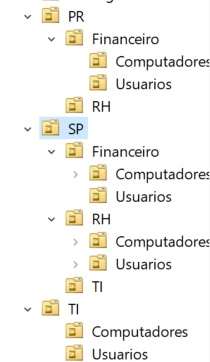

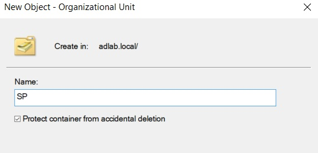

---

### **2.2. Criação dos Grupos de Segurança**

Grupos de segurança são a base para um gerenciamento de permissões eficiente e escalável. Em vez de dar permissão a cada usuário individualmente, nós as concedemos a um grupo. Foram criados alguns grupos dentro de suas respectivas OUs, como:

- **`Financeiro_SP`**: 
  - Propósito: Grupo organizacional para identificar os usuários pertencentes ao departamento Financeiro da filial de São Paulo (SP).

  - Uso: Ideal para aplicar políticas de grupo (GPOs) específicas para esses usuários ou para filtros de segurança.
- **`Acesso_Financeiro`**: 
  - Propósito: Grupo funcional criado especificamente para conceder permissões de acesso à pasta compartilhada do departamento Financeiro (\\\DC01\Setores\Financeiro).

  - Uso: É este grupo que recebe as permissões NTFS na pasta compartilhada. Os usuários do Financeiro devem ser membros deste grupo para acessar seus arquivos.
- **`Disable PowerS`**: 
  - Propósito: Grupo utilizado em conjunto com uma GPO para restringir o acesso ao PowerShell para usuários comuns, como medida de segurança.
  - Uso: Usuários adicionados a este grupo tem a execução do PowerShell bloqueada por uma política específica.
- **`Enable PowerS`**: 
  - Propósito: Grupo de exceção para permitir o acesso ao PowerShell para usuários específicos (ex: equipe de TI), mesmo que haja uma política de bloqueio geral.
  - Uso: Utilizado no Filtro de Segurança de uma GPO para negar a aplicação da política de bloqueio Disable PowerS aos seus membros.
- **`TI_FINANCEIRO`**: 
  - Propósito: Grupo criado para fins de teste e simulação, representando um membro da equipe de TI que teria responsabilidades ou acesso específico a recursos do departamento Financeiro.
  - Uso: Utilizado neste laboratório para praticar a criação de grupos e a associação de membros em cenários específicos.

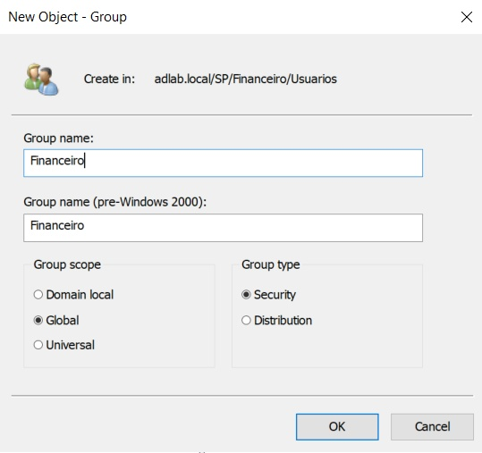

---

### **2.3. Criação dos Usuários de Teste**

Com a estrutura pronta, os usuários de teste foram criados, simulando funcionários de cada departamento.

**Usuários criados:**
- **Nome:** João Silva
  - **Logon:** `joao.silva@adlab.local`
  - **Departamento:** Inicialmente Financeiro, posteriormente movido para TI para fins de teste e validação
- **Nome:** Maria Souza
  - **Logon:** `maria.souza@adlab.local`
  - **Departamento:** Financeiro
- **Nome:** Marcos Pereira
  - **Logon:** `marcos.pereira@adlab.local`
  - **Departamento:** Financeiro
- **Nome:** Pedro Oliveira
  - **Logon:** `pedro.oliveira@adlab.local`
  - **Departamento:** Financeiro
- **Nome:** Felipe Cardoso
  - **Logon:** `felipe.cardoso@adlab.local`
  - **Departamento:** RH

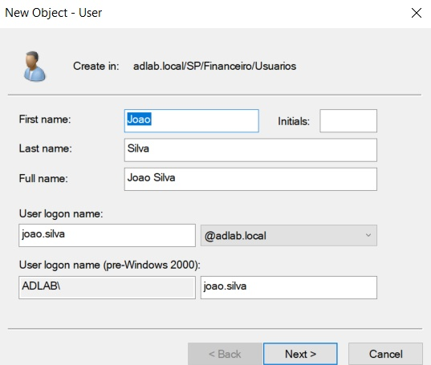

Foi marcada a opção "O usuário deve alterar a senha no próximo logon", uma prática padrão de segurança.

---

### **2.4. Associação de Usuários aos Grupos**

A etapa final é adicionar os usuários como membros dos grupos de segurança correspondentes. Isso garante que eles herdarão todas as permissões atribuídas àquele grupo.

- O usuário `joao.silva` foi adicionado ao grupo `Financeiro_SP`.

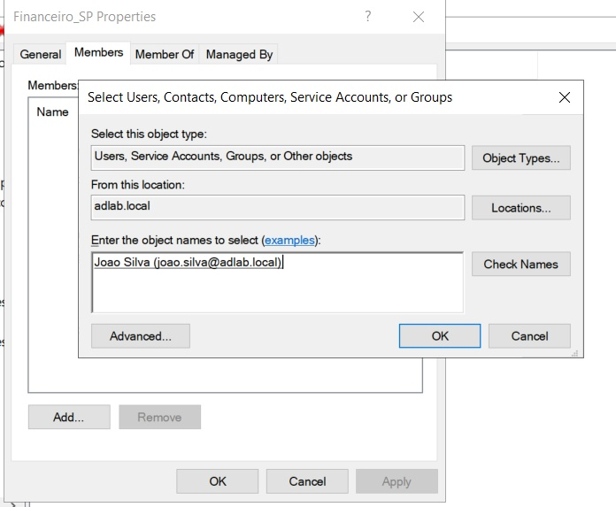

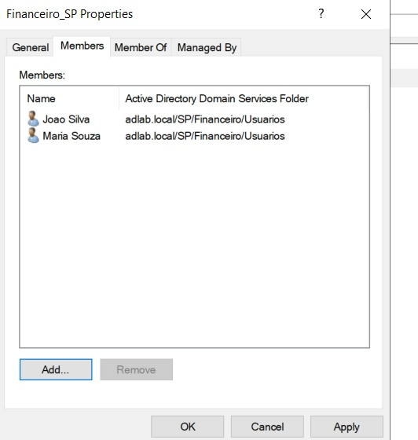

---

### **2.5. Simulação de Suporte: Reset de Senha e Desbloqueio**

Para simular tarefas comuns de um Help Desk, foram realizados os seguintes procedimentos de troubleshooting:

**1. Reset de Senha de Usuário:**

- **Cenário:** A usuária `maria.souza` esqueceu sua senha e, ao tentar logar, recebeu a mensagem de erro "Nome de usuário ou senha incorreto". Um chamado foi aberto para o Help Desk solicitando o reset.

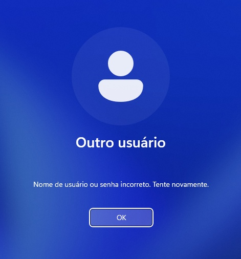

- **Ação:** O procedimento padrão de redefinição de senha foi executado no Active Directory. A conta da usuária foi localizada e uma nova senha temporária foi definida, com a opção "O usuário deve alterar a senha no próximo logon" marcada por segurança.

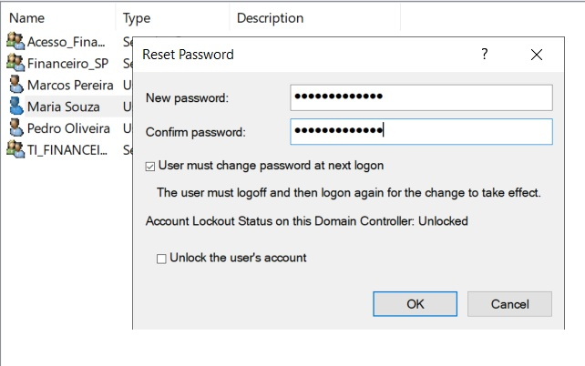

O sistema confirmou que a senha foi redefinida com sucesso no servidor.

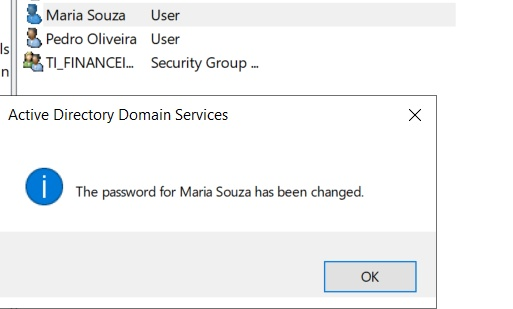

**Verificação do Ponto de Vista do Usuário:**

Após a ação do administrador, a usuária tentou logar novamente com a senha temporária fornecida.

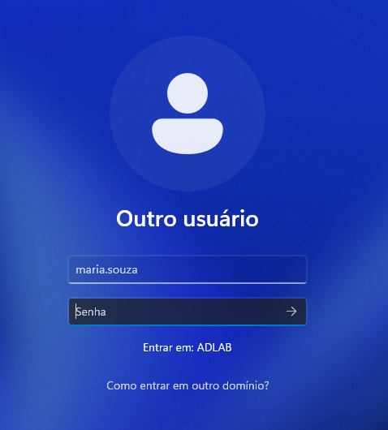

O sistema, seguindo a política de segurança definida, informou que a senha temporária precisava ser alterada antes de prosseguir.

A usuária então inseriu a senha temporária e criou sua nova senha pessoal e secreta.

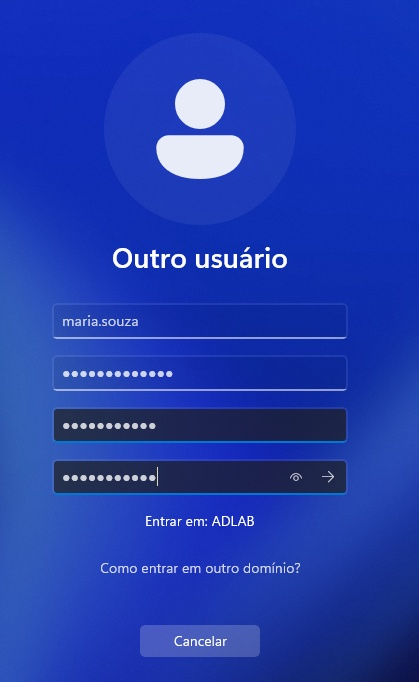

Após a troca, uma mensagem confirmou que a nova senha foi definida com sucesso.

Finalmente, o login foi concluído com sucesso, finalizando o chamado e restaurando o acesso da usuária.

---

**2. Desbloqueio de Conta:**

- **Cenário:** Após exceder o limite de tentativas de logon inválidas (definido na GPO de segurança), o usuário `marcos.pereira` foi impedido de logar, recebendo a mensagem de que sua conta estava bloqueada.

- **Ação do Administrador:** Para resolver o chamado, o administrador localizou o usuário no ADUC e acessou as "Propriedades" da conta. A aba "Conta" confirmou o status, exibindo a mensagem "This account is currently locked out...".

A solução foi simplesmente desmarcar a caixa de seleção "Unlock account" e aplicar a alteração, liberando o acesso do usuário.

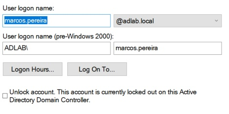

- **Verificação Final:** Após o desbloqueio no servidor, o usuário conseguiu realizar o logon com sucesso em sua estação de trabalho. O acesso foi confirmado com o comando `whoami` no prompt, finalizando o chamado.

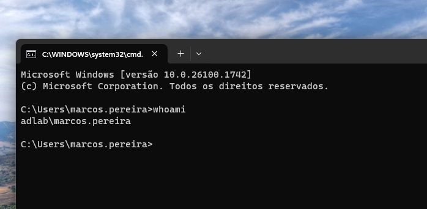

---

**Esta etapa foi concluída com sucesso. A estrutura básica de OUs, usuários e grupos está configurada, pronta para a aplicação de permissões na próxima fase.**

[➡️ Próximo Passo: 3. Compartilhamento de Pastas e Permissões](03-Compartilhamento-de-Pastas.md)