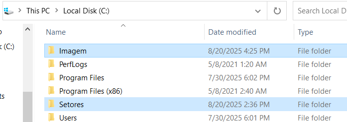
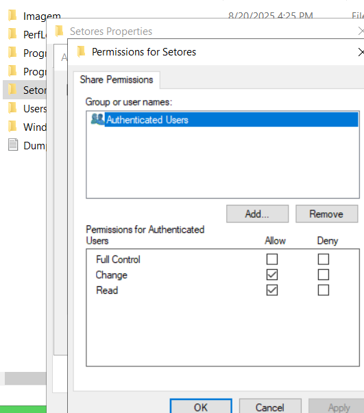
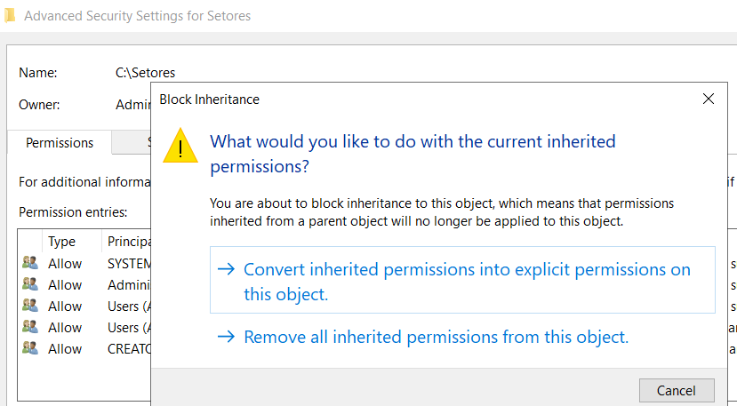
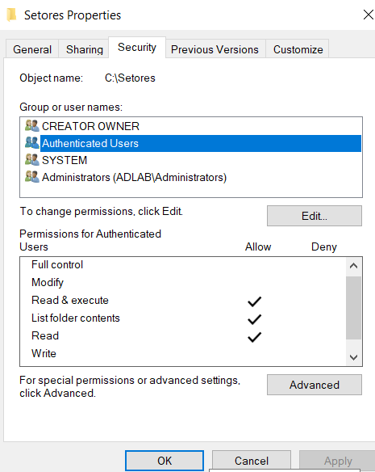
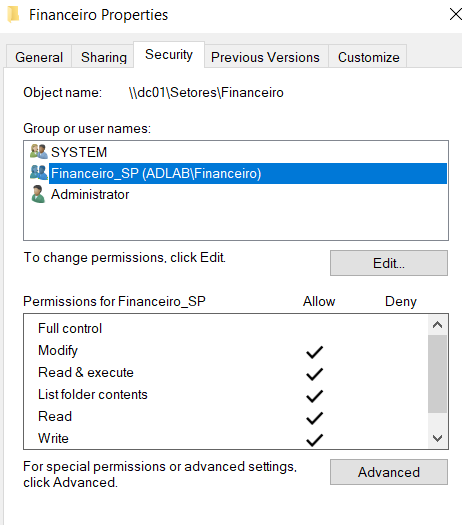
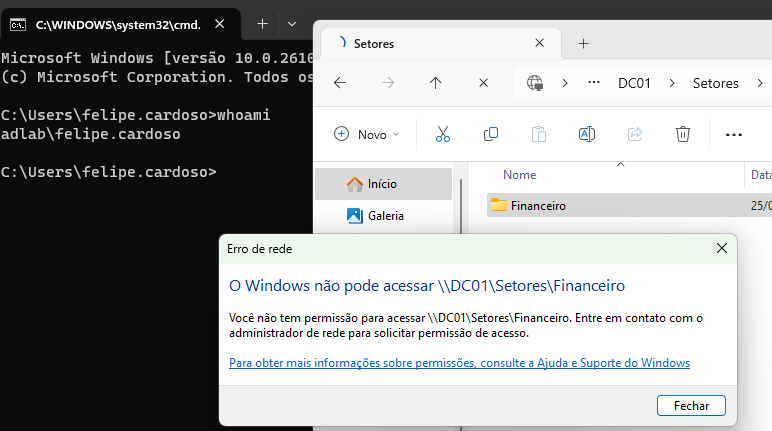
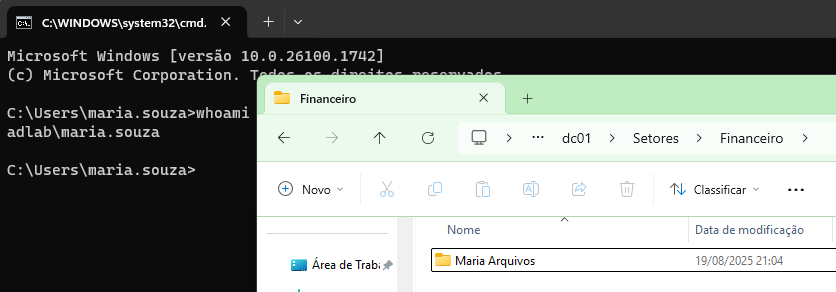

# 📂 3. Compartilhamento de Pastas e Permissões (File Server)

[⬅️ Etapa Anterior: 2. Gerenciamento de Usuários e Grupos](02-Gerenciamento-de-Usuarios.md) | [⬆️ Voltar para o Sumário Principal (README)](../README.md)

---

## 📝 Descrição da Etapa

Este documento detalha a configuração de um compartilhamento de rede (File Server) no servidor `DC01`. O objetivo é criar pastas para os departamentos e aplicar permissões de acesso granulares, garantindo que os usuários de um setor não possam acessar os dados de outro.

---

## 📋 Índice

- [3.1. Criação da Estrutura de Pastas no Servidor](#31-criação-da-estrutura-de-pastas-no-servidor)
- [3.2. Configuração das Permissões de Compartilhamento](#32-configuração-das-permissões-de-compartilhamento)
- [3.3. Configuração das Permissões NTFS](#33-configuração-das-permissões-ntfs)
- [3.4. Verificação do Acesso no Cliente](#34-verificação-do-acesso-no-cliente)

---

### **3.1. Criação da Estrutura de Pastas no Servidor**

O primeiro passo foi criar a estrutura física de diretórios no disco do servidor. Foi criada uma pasta raiz `Setores` no disco `C:\` para abrigar as pastas departamentais.

**Estrutura criada:**

- `C:\Imagem` (contendo arquivo .png para futura aplicação de GPO que simula padronização de tela de fundo em ambiente de trabalho. Veja a [Etapa 4.4: Padronização do Ambiente de Trabalho](04-Politicas-de-Grupo.md#44-gpo-3-padronização-do-ambiente-de-trabalho))
- `C:\Setores`
  - `Financeiro`
    - `Maria Arquivos`

---

### **3.2. Configuração das Permissões de Compartilhamento**

A estratégia utilizada foi criar um ponto de acesso central para todos os departamentos, compartilhando a pasta raiz `C:\Setores`.

Para as permissões de compartilhamento, foi seguida a melhor prática de segurança e gerenciamento: o grupo `Everyone` foi removido e substituído por **`Authenticated Users` (Usuários Autenticados)**. A este grupo foi concedida a permissão de **`Change e Read` (Modificação e Leitura)**.

Essa abordagem permissiva na camada de compartilhamento simplifica a administração e garante que o controle de acesso granular e efetivo seja gerenciado exclusivamente pela camada NTFS.

---

### **3.3. Configuração das Permissões NTFS (Pai e Filho)**

Com o compartilhamento configurado, a segurança granular foi aplicada em duas camadas no NTFS para proteger a estrutura de pastas.

**1. Permissões na Pasta-Pai (O "Corredor"):**
Primeiro, na pasta-pai `C:\Setores`, as permissões herdadas do disco C:\ foram desabilitadas. As permissões existentes foram convertidas em permissões explícitas para permitir a customização.

Em seguida, as permissões foram limpas: o grupo `Users` foi removido e ao grupo `Authenticated Users` foram concedidas apenas permissões de **`Read & execute`** e **`List folder contents`**. Isso permite que todos os funcionários naveguem pelo "corredor" e vejam as pastas dos departamentos, mas os impede de criar ou excluir qualquer coisa na raiz do compartilhamento.

**2. Permissões na Subpasta (A "Sala do Financeiro"):**
Finalmente, na subpasta `C:\Setores\Financeiro`, o grupo de segurança específico do departamento, **`Financeiro_SP`**, foi adicionado. A este grupo foi concedida a permissão de **"Modificar" (Modify)**.

Isso garante que, embora todos possam ver a pasta "Financeiro", apenas os membros desse grupo podem entrar nela para criar, ler, editar e excluir arquivos, seguindo o Princípio do Menor Privilégio.

---

### **3.4. Verificação do Acesso no Cliente**

A etapa final é verificar se as permissões estão funcionando como esperado. Para isso, fiz logon na máquina cliente com diferentes usuários e tentei acessar as pastas.

**Teste 1: Usuário do RH (`felipe.cardoso`)**
- Acesso a `\\DC01\Setores\Financeiro`: **FALHA (Acesso Negado)** ❌

**Teste 2: Usuário do Financeiro (`maria.souza`)**
- Acesso a `\\DC01\Setores\Financeiro`: **SUCESSO** ✅

---

**Esta etapa foi concluída com sucesso. O servidor de arquivos básico está configurado e as permissões de acesso baseadas em grupos estão validadas e funcionando corretamente.**

[➡️ Próximo Passo: 4. Políticas de Grupo (GPO)](04-Politicas-de-Grupo.md)