# 🔒 4. Políticas de Grupo (GPO)

[⬅️ Etapa Anterior: 3. Compartilhamento de Pastas e Permissões](03-Compartilhamento-de-Pastas.md) | [⬆️ Voltar para o Sumário Principal (README)](../README.md)

---

## 📝 Descrição da Etapa

Este documento detalha a implementação de Políticas de Grupo (GPOs) para automatizar configurações, reforçar a segurança e padronizar a experiência do usuário no domínio `adlab.local`. As GPOs são uma ferramenta essencial para a administração eficiente de um ambiente Windows Server.

---

## 📋 Índice

- [4.1. Visão Geral do Gerenciamento de GPO](#41-visão-geral-do-gerenciamento-de-gpo)
- [4.2. GPO 1: Política de Senhas e Bloqueio (Default Domain Policy)](#42-gpo-1-política-de-senhas-e-bloqueio-de-conta-default-domain-policy)
- [4.3. GPO 2: Mapeamento de Unidade de Rede para o Financeiro](#43-gpo-2-mapeamento-de-unidade-de-rede-para-o-financeiro)
- [4.4. GPO 3: Padronização do Ambiente de Trabalho](#44-gpo-3-padronização-do-ambiente-de-trabalho)
- [4.5. GPO 4: Política de Auditoria de Logon](#45-gpo-4-política-de-auditoria-de-logon)
- [4.6. GPO 5: Restrição de Acesso ao PowerShell](#46-gpo-5-restrição-de-acesso-ao-powershell)
- [4.7. GPO 6: Liberação do PowerShell para a Equipe de TI](#47-gpo-6-liberação-do-powershell-para-a-equipe-de-ti)
- [4.8. Verificação da Aplicação das Políticas no Cliente](#48-verificação-da-aplicação-das-políticas-no-cliente)

---

### **4.1. Visão Geral do Gerenciamento de GPO**

Toda a configuração de GPOs é centralizada no console **"Gerenciamento de Política de Grupo" (Group Policy Management)**. A partir dele, é possível criar, editar e vincular (linkar) as políticas às Unidades Organizacionais (OUs) desejadas.

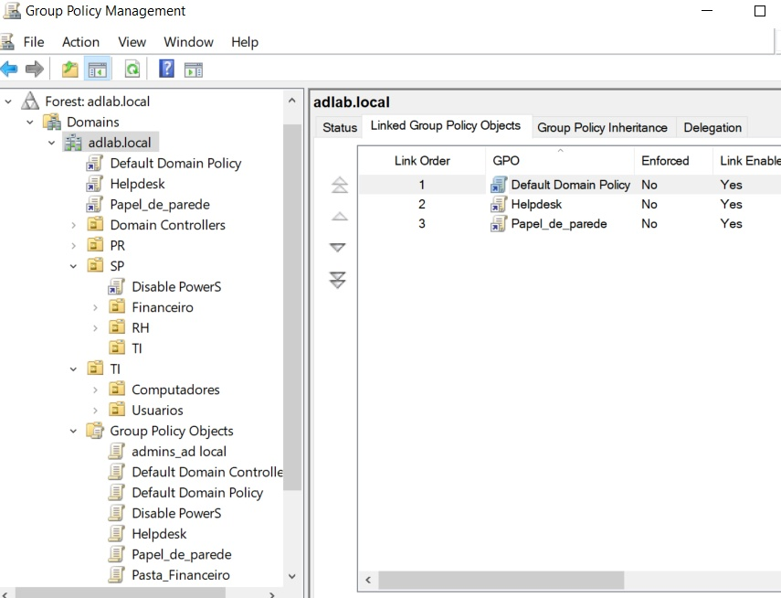

---

### **4.2. GPO 1: Política de Senhas e Bloqueio de Conta (Default Domain Policy)**

Por padrão, as políticas de senha e bloqueio de conta que afetam todo o domínio devem ser configuradas na GPO **"Default Domain Policy"**. Isso garante que uma linha de base de segurança seja aplicada a todos os usuários.

**Configurações aplicadas:**
- **Política de Senha:**
  - Comprimento mínimo: [8 caracteres]
  - Senha deve atender aos requisitos de complexidade: Habilitado

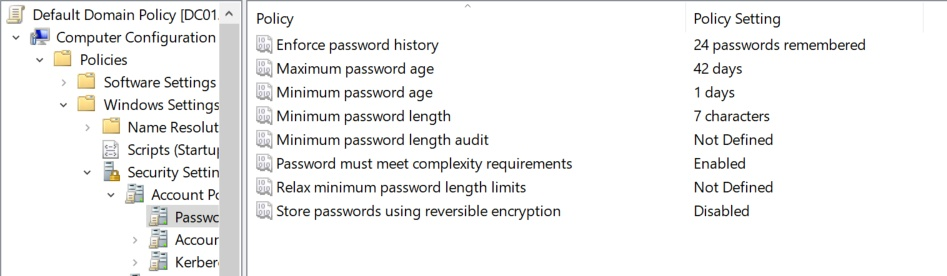
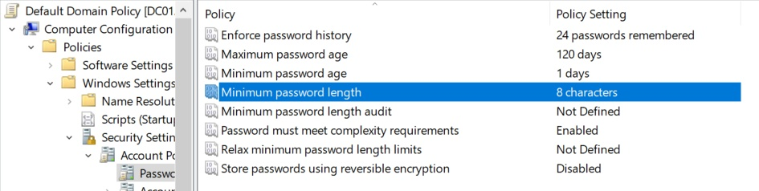

- **Política de Bloqueio de Conta:**
  - Limite de tentativas de logon inválidas: [5 tentativas]
  - Duração do bloqueio da conta: [30 minutos]

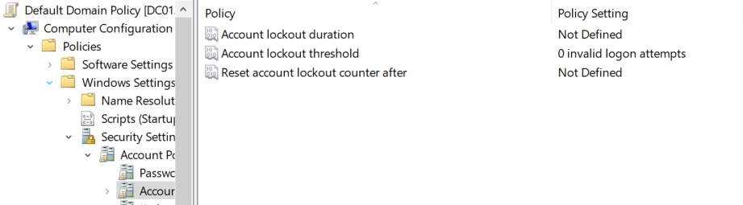
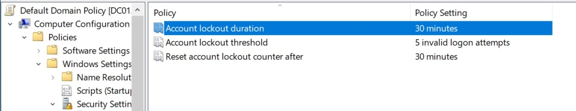

---

### **4.3. GPO 2: Mapeamento de Unidade de Rede para o Financeiro**

Para automatizar o acesso à pasta do departamento Financeiro, foi criada uma GPO específica para mapear a pasta compartilhada como uma unidade de rede (ex: F:) no computador dos usuários.

**1. Criação do Objeto GPO:**
Primeiro, um novo objeto GPO chamado `Pasta_Financeiro` foi criado.

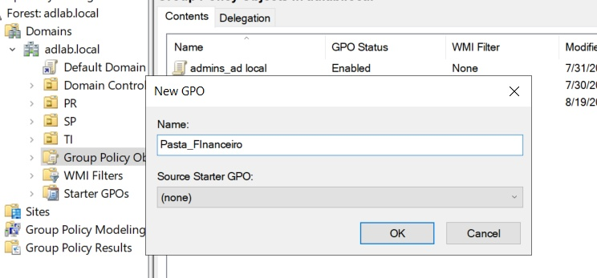

**2. Configuração do Mapeamento:**
A GPO foi editada para adicionar uma nova política de Mapeamento de Unidade em `Configuração do Usuário -> Preferências -> Configurações do Windows -> Mapeamento de Unidades`.
- **Ação:** Atualizar
- **Caminho:** `\\DC01\Setores\Financeiro`
- **Letra da Unidade:** F:

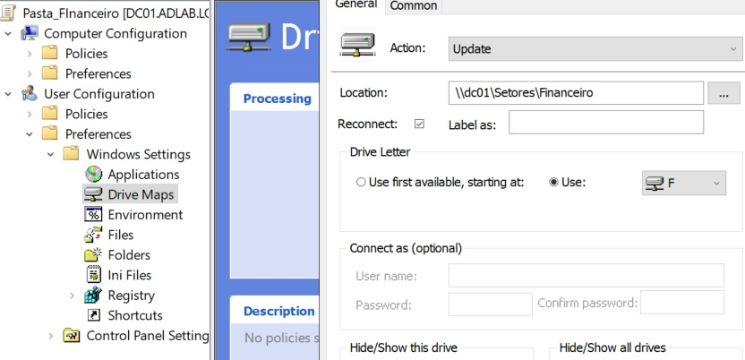

**3. Vinculação (Link) da GPO:**
Finalmente, a GPO `Pasta_Financeiro` foi vinculada (linkada) à OU `Financeiro`. Isso garante que apenas os usuários que estiverem dentro desta OU receberão a política de mapeamento.

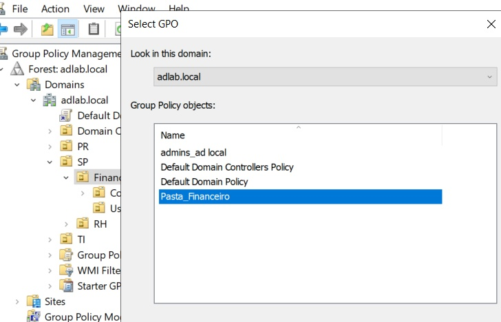

---

### **4.4. GPO 3: Padronização do Ambiente de Trabalho**

Para manter um ambiente de trabalho padronizado, uma GPO foi criada para definir um papel de parede padrão para todos os usuários.

**Preparação do Recurso (Imagem de Fundo):**

Criado a pasta "Imagem" para compartilhamento da imagem padrão:

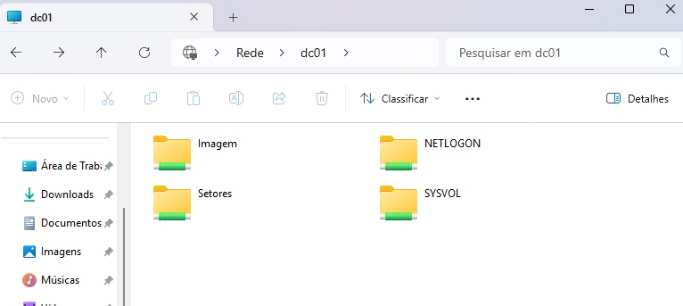

Inserido imagem para padronização:

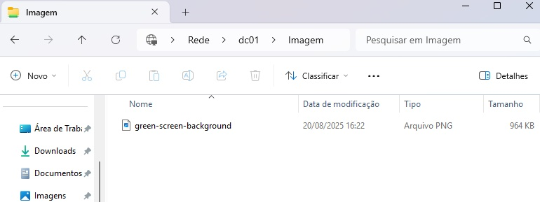

**Configurações aplicadas:**

Configurando a padronização:

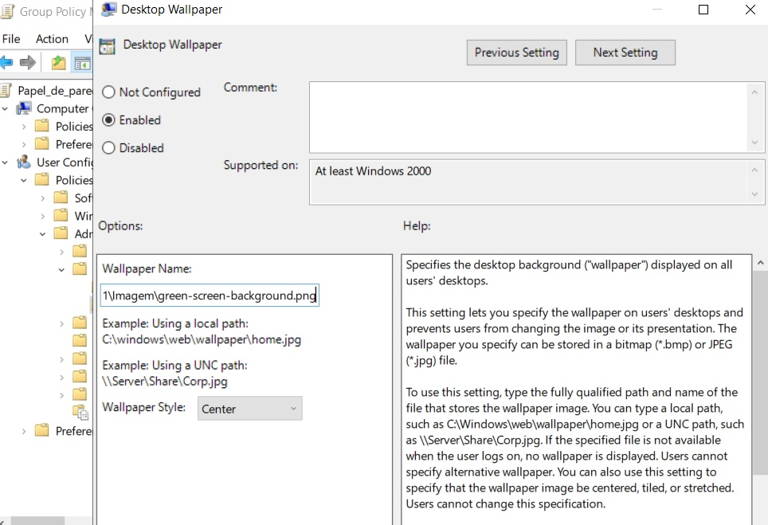

Desabilitando mudanças:

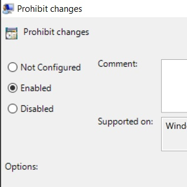

Logoff para aplicar mudanças (antes):

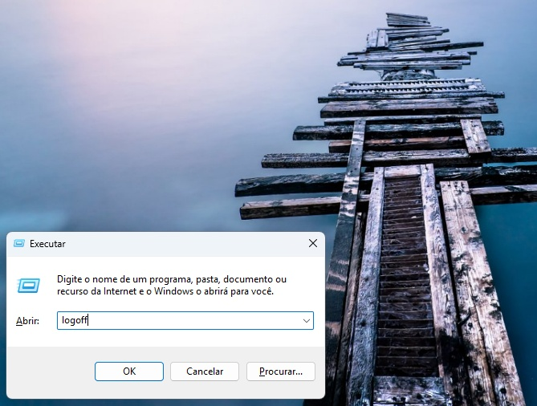

Após novo login:

Tela de personalização, exibindo a desabilitação de mudanças de papel de parede:

---

### **4.5. GPO 4: Política de Auditoria de Logon**

Para aumentar a segurança e a visibilidade do ambiente, foi configurada uma política para auditar tentativas de logon, especificamente falhas. Isso é crucial para detectar possíveis tentativas de acesso indevido.

**1. Configuração da Política de Auditoria:**

A política "Auditar eventos de logon" foi habilitada na GPO para registrar as tentativas que resultassem em "Falha". A imagem abaixo mostra a configuração padrão antes da alteração.

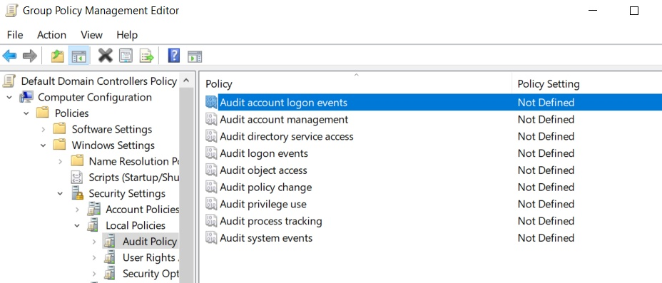

A GPO foi editada no caminho `Computer Configuration -> Policies -> Windows Settings -> Security Settings -> Local Policies -> Audit Policy` para habilitar o registro de falhas.

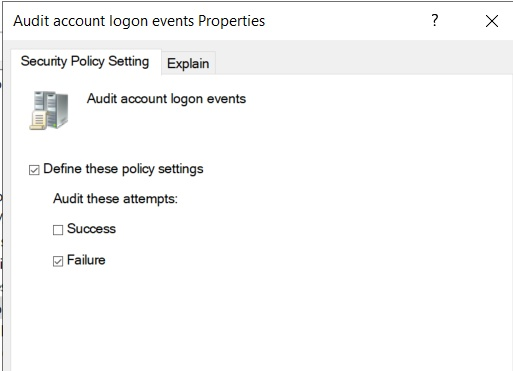

A configuração final foi definida para auditar apenas as falhas. Esta é uma prática fundamental de segurança e otimização, pois não só reduz o ruído nos logs, focando a atenção em eventos acionáveis, mas também previne o impacto no desempenho e no armazenamento do servidor que o registro massivo de eventos de sucesso geraria.

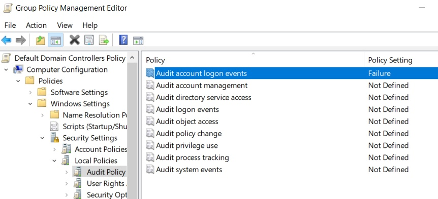

**2. Verificação da Auditoria:**

Para verificar se a política estava funcionando, uma tentativa de login com senha incorreta foi forçada na máquina cliente.

O sistema retornou a mensagem de erro esperada, indicando que a tentativa de logon falhou.

Imediatamente após a falha, o Visualizador de Eventos (`Event Viewer`) no DC01 foi inspecionado. Como esperado, um novo evento de segurança com o **ID 4771** foi registrado, confirmando que a GPO de auditoria funcionou perfeitamente.

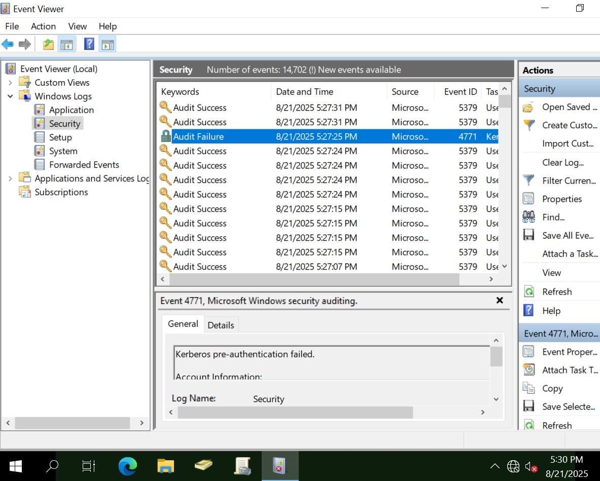

Ao abrir as propriedades do evento, é possível ver detalhes cruciais para uma investigação de segurança, como o nome da conta que falhou e o endereço de origem da tentativa.

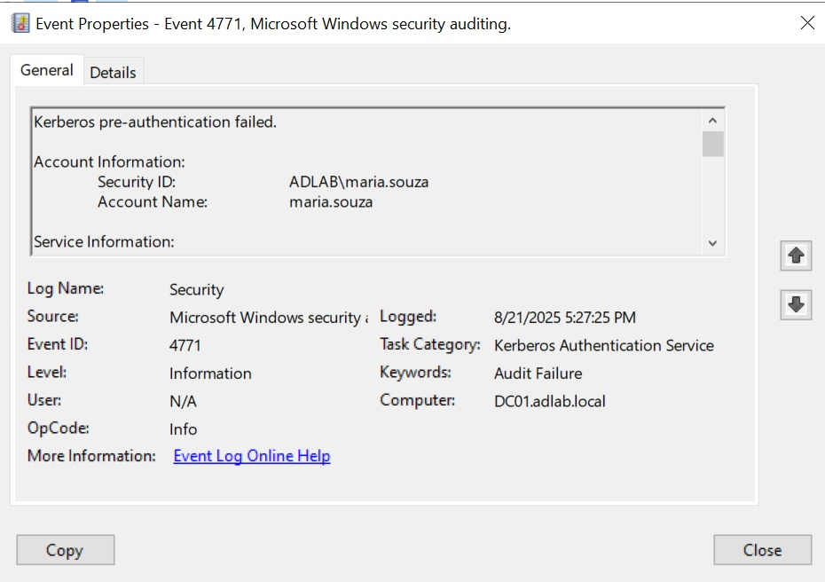

Também foi possível filtrar os eventos pela ID desejada (4771) para facilitar a visualização

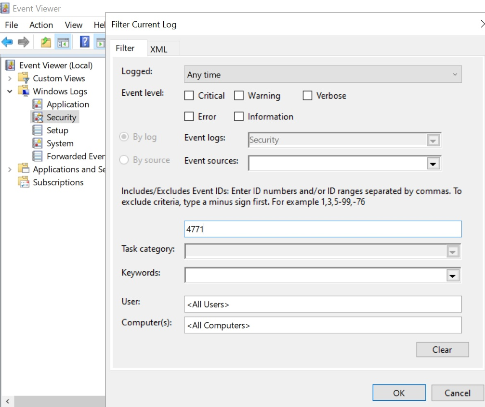
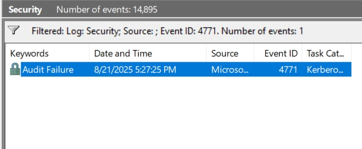

---

### **4.6. GPO 5: Restrição de Acesso ao PowerShell**

Considerando que o PowerShell pode ser um vetor para malwares, uma política restritiva foi criada para desabilitá-lo para usuários comuns, seguindo o princípio de menor privilégio.

**1. Cenário Inicial:**
Antes da aplicação da política, a usuária de teste `maria.souza` conseguia abrir o PowerShell normalmente.

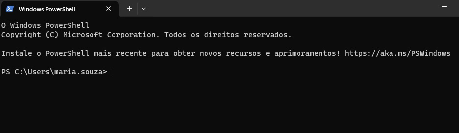

**2. Configuração da GPO de Bloqueio:**
Foi criada uma nova GPO chamada `Disable PowerS`. Dentro dela, foi configurada a política "Não executar aplicativos do Windows especificados" (`Don't run specified Windows applications`), localizada em `User Configuration -> Policies -> Administrative Templates -> System`.

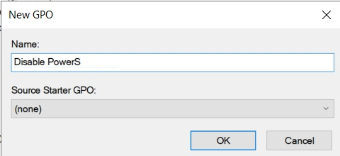
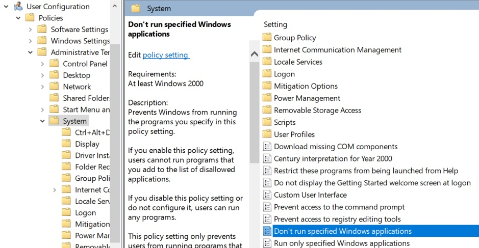

Os executáveis `PowerShell.exe` e `PowerShell_ise.exe` foram adicionados à lista de aplicativos não permitidos.

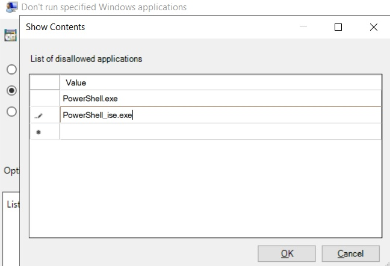

**3. Resultado da Restrição:**
Após a GPO ser vinculada à OU dos usuários e as políticas serem atualizadas, a mesma usuária `maria.souza` tentou executar o PowerShell novamente. Desta vez, a operação foi cancelada e uma mensagem de restrição foi exibida, confirmando que a GPO foi aplicada com sucesso.

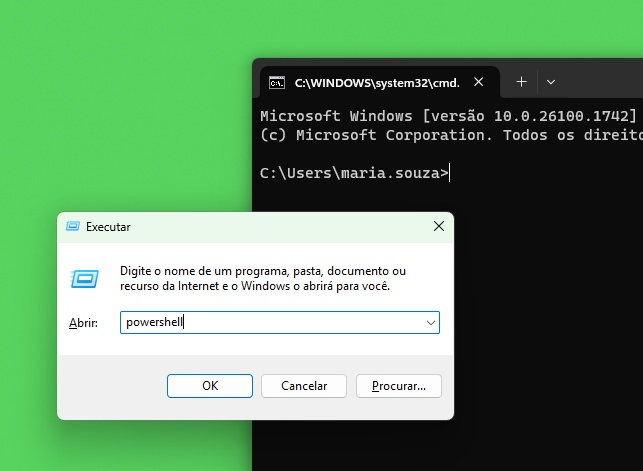
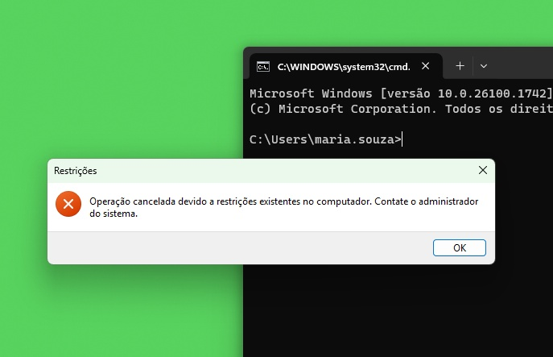

---

### **4.7. GPO 6: Liberação do PowerShell para a Equipe de TI**

Para garantir que a equipe de TI ou usuários autorizados pudessem continuar utilizando o PowerShell, em vez de criar uma GPO de anulação, foi utilizada a técnica de **Filtro de Segurança** na GPO de bloqueio original.

**1. Criação do Grupo de Exceção:**
Primeiro, foi criado um grupo de segurança chamado `Enable PowerS`. Usuários que precisarem de acesso ao PowerShell, como a `Maria Souza` (simulando uma funcionária de TI), foi adicionada a este grupo.

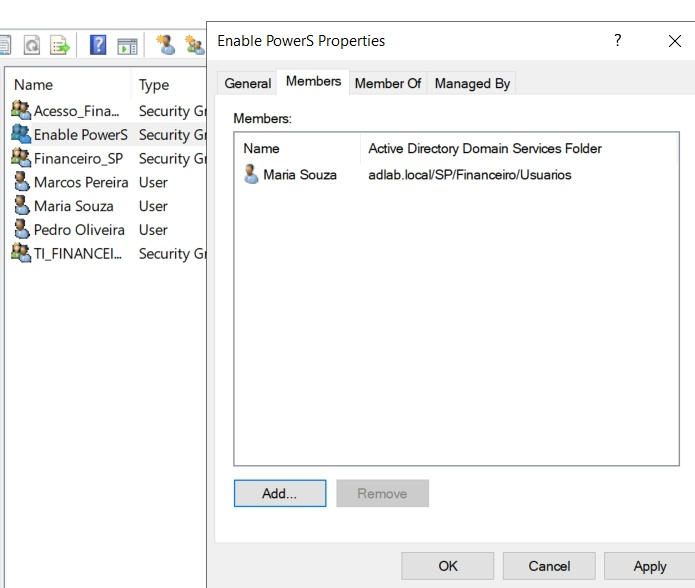

**2. Configuração do Filtro de Segurança na GPO:**
Na GPO `Disable PowerS`, na aba **"Delegação"**, o grupo `Enable PowerS` foi adicionado. Em seguida, foi configurada uma permissão avançada para **negar** (`Deny`) a permissão de **"Aplicar política de grupo" (`Apply group policy`)** para este grupo específico.

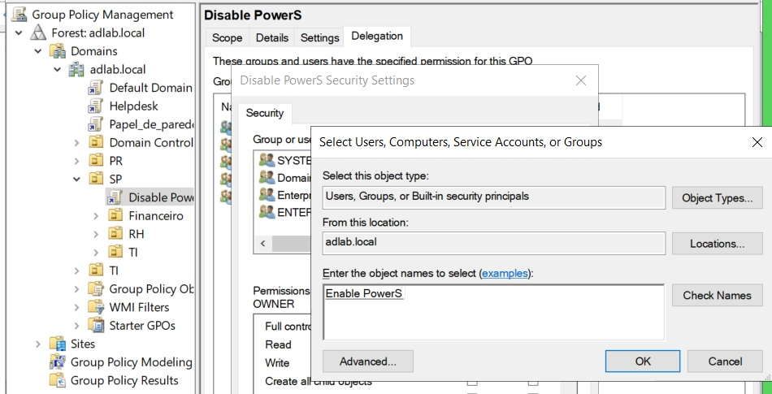
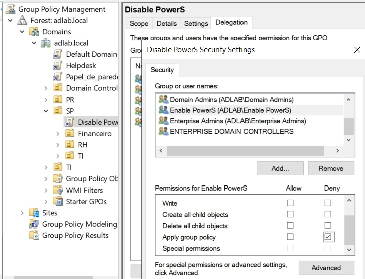

Essa configuração instrui o sistema a aplicar a GPO de bloqueio a todos, exceto aos membros do grupo `Enable PowerS`.

**3. Resultado da Liberação:**
Após a atualização das políticas, a usuária `maria.souza`, agora membro do grupo de exceção, conseguiu executar tanto o PowerShell quanto o PowerShell ISE sem restrições, confirmando o sucesso da configuração do filtro.

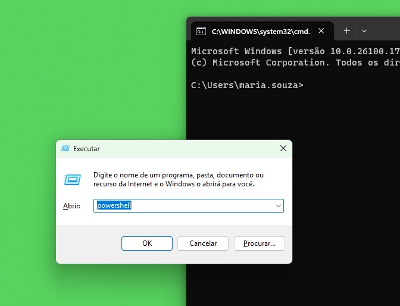
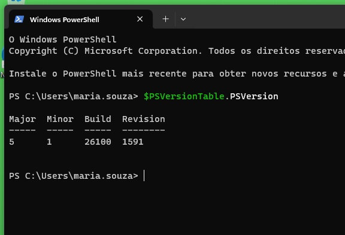
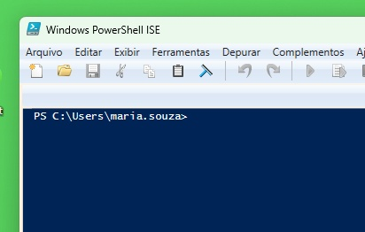

---

### **4.8. Verificação da Aplicação das Políticas no Cliente**

A etapa final é confirmar que as políticas foram aplicadas corretamente na máquina cliente após o logon de um usuário de teste (`maria.souza` do Financeiro).

**1. Verificação via Comando:**
O comando `gpresult /r` foi executado no `cmd` do cliente para listar as políticas de grupo aplicadas. O resultado confirmou que a GPO `Pasta_Financeiro` estava na lista de "OBJETOS DE POLÍTICA DE GRUPO APLICADOS".

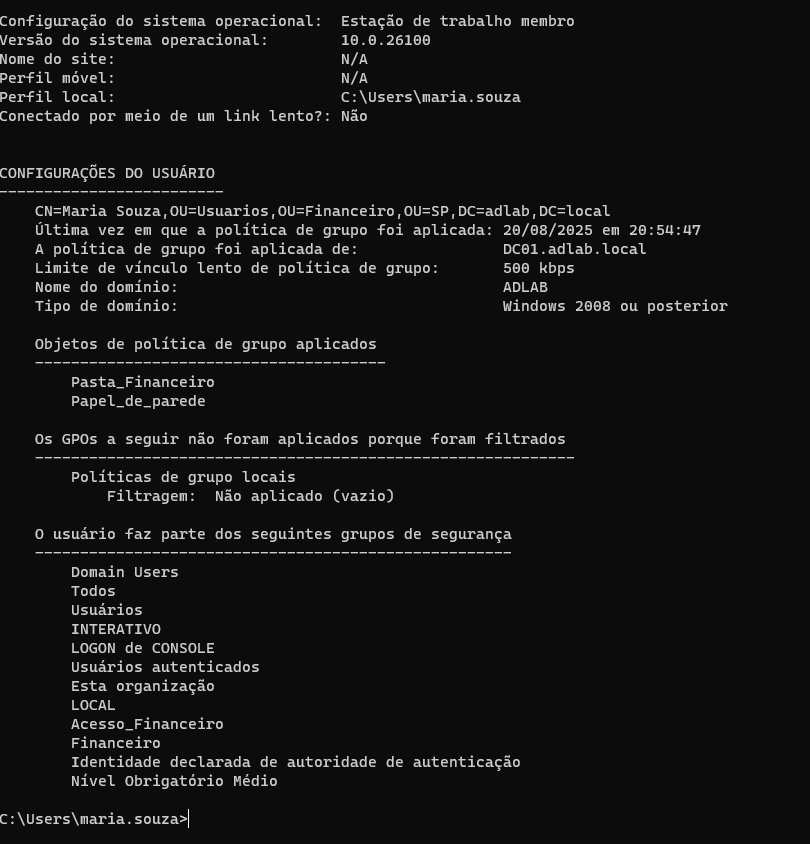

**2. Verificação Visual:**
Uma inspeção visual no `Explorador de Arquivos` do cliente confirmou que a unidade de rede **F:**, apontando para a pasta do Financeiro, foi mapeada com sucesso.

---

**Esta etapa foi concluída com sucesso. As GPOs configuradas estão sendo aplicadas e funcionam como esperado, demonstrando a capacidade de gerenciamento centralizado do ambiente.**

[⬆️ Voltar para o Sumário Principal (README)](../README.md)