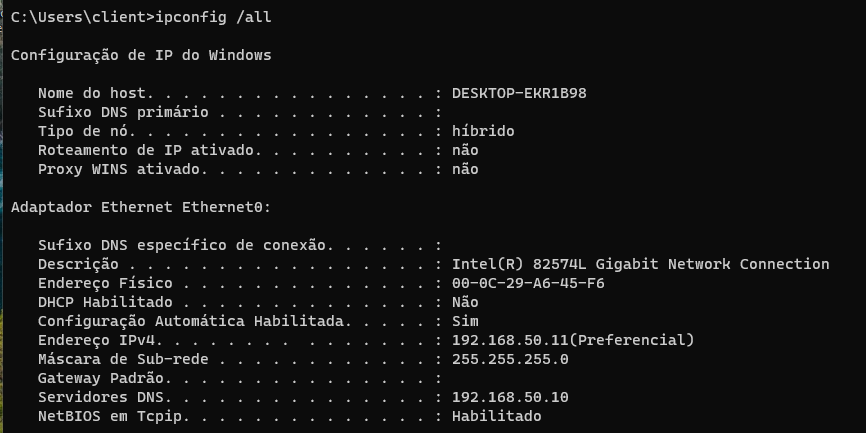
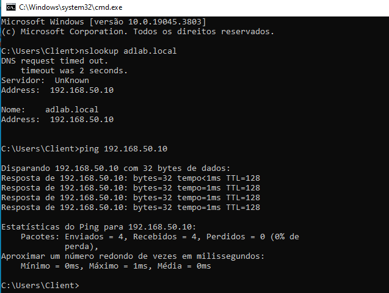
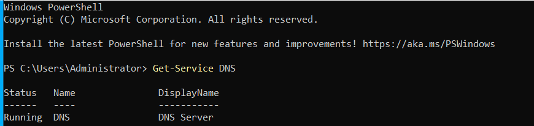
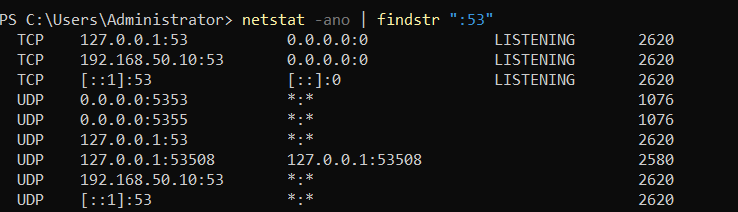
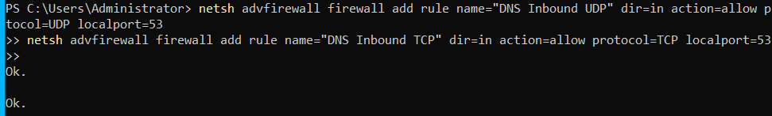
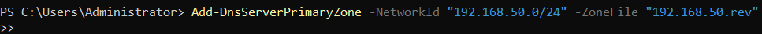
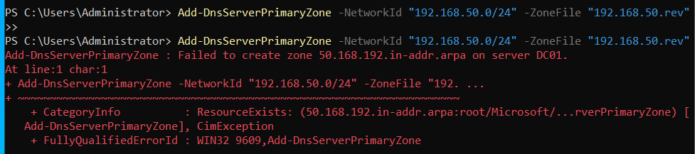
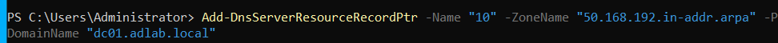
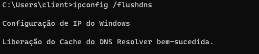
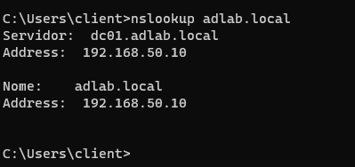

[⬆️ Voltar para o Sumário Principal (README)](../README.md)

---

# 🧩 Problema: Cliente não resolve o domínio adlab.local

## 📍 Cenário

Durante a configuração do ambiente Active Directory (AD DS) em um homelab, o cliente Windows não conseguia resolver o nome de domínio do servidor (`adlab.local`), retornando erro de **DNS request timed out**, apesar de a comunicação ICMP (ping) funcionar normalmente. A configuração estava sendo realizada utilizando o VirtualBox. Posteriormente, foi criada e configurada desta vez utilizando VMWare, porém o erro persistia. Este troubleshooting em específico foi realizado com extensa assistência de ferramentas IA, visto que este problema está além do conhecimento inicial.

- **Server (DC01):** `192.168.50.10`
- **Client:** `192.168.50.11`
- **Rede:** Host-only / `192.168.50.0/24`
- **DNS configurado no cliente:** `192.168.50.10` (o próprio DC01)

---

## 🔍 Diagnóstico passo a passo

Antes de investigar o servidor, a configuração do cliente foi verificada com ipconfig /all, confirmando que o IP e o servidor DNS estavam corretamente definidos.



---

### 🧠 Passo 1: Teste básico de rede

Executado no cliente:
```cmd
ping 192.168.50.10
```

✅ Resultado: Respostas normais → comunicação entre as VMs estava funcionando.

❌ Problema persistia ao testar DNS:

```cmd
nslookup adlab.local
```

Retornava:
```cmd
DNS request timed out.
Servidor: Unknown
Address: 192.168.50.10
```



➡️ Conclusão: o serviço DNS estava inacessível, apesar de o servidor estar respondendo.

---

### ⚙️ Passo 2: Verificar se o serviço DNS estava ativo

No servidor:

```powershell
Get-Service DNS
```
✅ Resultado:
>```
>Status  Name  DisplayName
>------  ----  ------------
>Running DNS   DNS Server
>```



➡️ Conclusão: o serviço DNS estava em execução, então o problema não era o serviço parado.

---

### 🔥 Passo 3: Checagem de portas DNS (53 TCP/UDP)

Verificação com netstat:

```cmd
netstat -ano | findstr ":53"
```




✅ Resultado: o servidor estava escutando nas portas 53 (TCP e UDP).
➡️ Isso confirmou que o DNS estava aceitando conexões.

---

### 🧱 Passo 4: Teste de firewall

Foram criadas regras para liberar tráfego DNS, apenas para garantir que o firewall não bloqueasse:

```cmd
netsh advfirewall firewall add rule name="DNS Inbound UDP" dir=in action=allow protocol=UDP localport=53
netsh advfirewall firewall add rule name="DNS Inbound TCP" dir=in action=allow protocol=TCP localport=53
```

✅ Ambos executaram com sucesso.
Mesmo assim, o timeout persistia — o que indicava que o problema não estava na camada de rede ou firewall.



---

### 🧭 Passo 5: Verificar zonas DNS existentes

No DNS Manager, observou-se que existia apenas a zona direta (Forward Lookup Zone) adlab.local, mas não havia zona reversa (Reverse Lookup Zone).

Isso explicava o comportamento:
➡️ O cliente conseguia encontrar o IP (host A estava correto), mas o servidor não tinha mapeamento inverso (PTR), o que causava o timeout no nslookup.

---

## 🛠️ Solução

### 🧩 Etapa 1: Criar zona reversa (PTR)

No servidor (DC01), foi criada a zona reversa correspondente à sub-rede:

```powershell
Add-DnsServerPrimaryZone -NetworkId "192.168.50.0/24" -ZoneFile "192.168.50.rev"

```

✅ Primeira execução: criou com sucesso



⚠️ Segunda execução: retornou erro ResourceExists, confirmando que a zona já existia.



---

### 🧩 Etapa 2: Adicionar registro PTR para o servidor

```powershell
Add-DnsServerResourceRecordPtr -Name "10" -ZoneName "50.168.192.in-addr.arpa" -PtrDomainName "dc01.adlab.local"
```


✅ Primeira execução: criou com sucesso

⚠️ Segunda execução: retornou erro ResourceExists, indicando que o registro PTR já estava criado.

#### Etapa 2.1: Limpar Cache DNS do Cliente

Antes de testar novamente, o cache DNS do cliente foi limpo:



---

### 🧩 Etapa 3: Testar novamente no cliente

```cmd
nslookup adlab.local
```

✅ Resultado:

```
Servidor:  dc01.adlab.local
Address:   192.168.50.10

```



O cliente agora reconhecia corretamente o nome e o endereço do servidor DNS.

---


